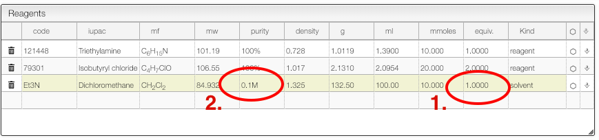

## Calculate solvent volume to reach specific concentration

For some reaction it is important to calculate the solvent to reach a specific concentration.

The reagent table allows to do this:

1. For the solvent enter as number of equivalent '1'
2. Enter the concentration you want to achieve in the 'Purity' column.

