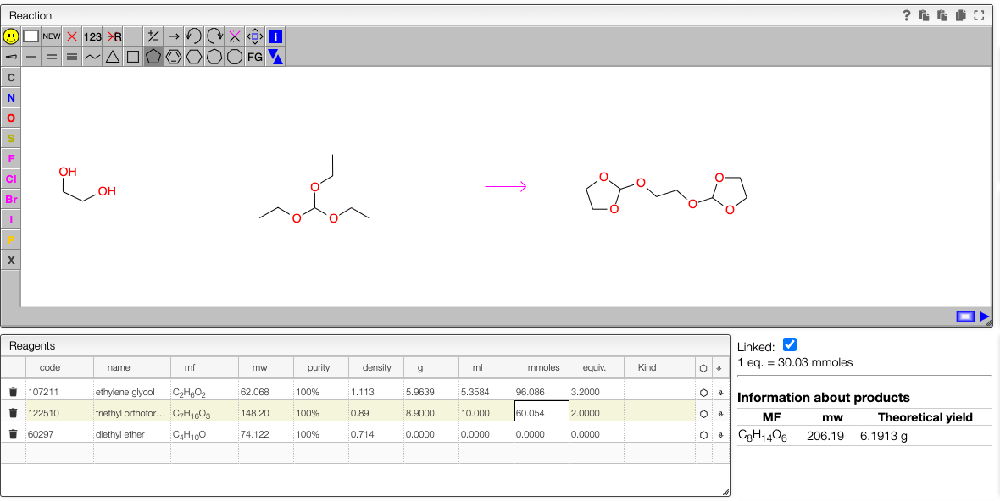

## Same reagent multiple times

In some reactions like in the example bellow many times the same reagent combines to yield the final product.

In this example that we did many years ago the mixture of ethylene glycol with triethyl orthoformate yields to a cyclic orthoester. In order to enter the quantities for this kind of reaction you need specify correctly the number of equivalents of the reagent that limits the yield. In this case the triethyl orthoformate limits the yield so we enter 2 equivalents for this reagent.

