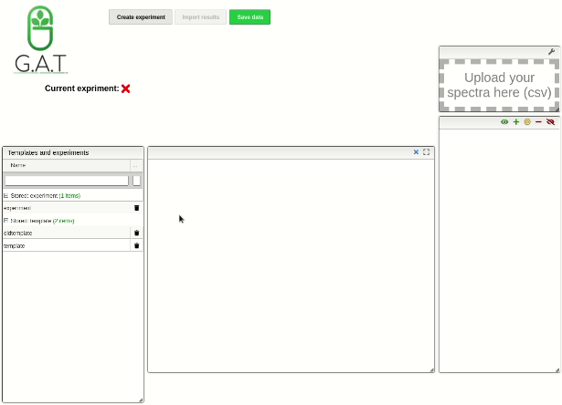
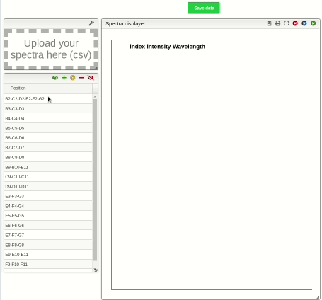

# Save experimental data

## Load the experimental data

To load the data, just pick the previous designed experiment in the "Templates and experiment" table. Later click on "Upload your spectra" window and wait for the pop-up window to find the file with the experimental data in the necessary location.

## Check the results and save

Once the data is loaded the system is responsible for automatically recognizing the replicates and the user is able to watch the spectra one by one or compare between them furthermore, the possibility to choose which of the replicates contribute to the average.

