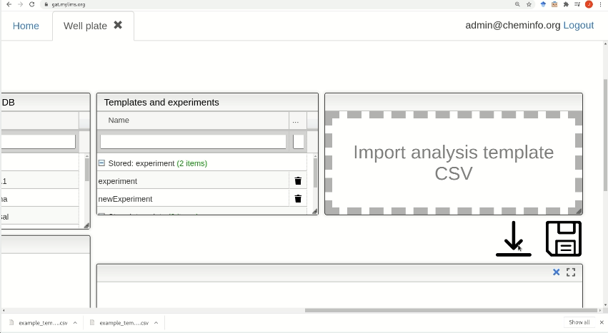
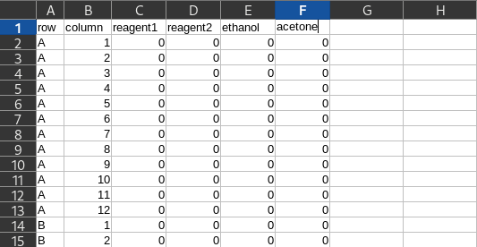

# Create and reuse well plate templates

To get started just click on the black arrow to download an empty template.

## How to build your own experiment template?

The blank template is a csv file. In the template, each row corresponds to a well on the plate. The first and second columns of the file are assigned to define the corresponding row and column of the well to be detailed.  Additional columns will specify the concentration of the reagents used to perform the experiment and the user can add as many columns as reagents need in the experiment. The labels corresponding to the columns reagents may be edited as the user considers it appropriate.

## Load and save your template for future experiments

To reuse a previously saved template just choose one of those available in the window. In order to load a template into the platform, just drag and drop the template file inside the "Import template" window or click on this window and wait for the pop-up window to find the template in the necessary location and later push save.

