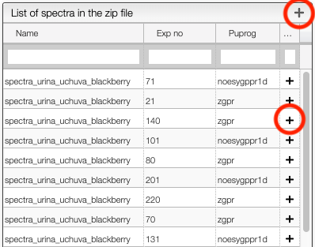
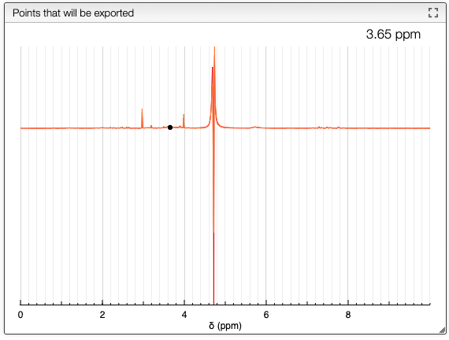
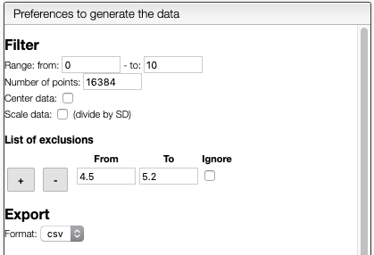

# Generate a matrix from a zip of NMR spectra

This tool allows to generate a matrix (CSV file) from a zip file containing Bruker experiments.

The zip file must contain the spectra after fourier transform. Here is an example of the content of the zip:

```bash
./spectra_urina_uchuva_blackberry/121
./spectra_urina_uchuva_blackberry/121/uxnmr.par
./spectra_urina_uchuva_blackberry/121/pulseprogram
./spectra_urina_uchuva_blackberry/121/format.temp
./spectra_urina_uchuva_blackberry/121/audita.txt
./spectra_urina_uchuva_blackberry/121/pdata
./spectra_urina_uchuva_blackberry/121/pdata/1
./spectra_urina_uchuva_blackberry/121/pdata/1/proc
./spectra_urina_uchuva_blackberry/121/pdata/1/title
./spectra_urina_uchuva_blackberry/121/pdata/1/auditp.txt
./spectra_urina_uchuva_blackberry/121/pdata/1/assocs
./spectra_urina_uchuva_blackberry/121/pdata/1/1r
./spectra_urina_uchuva_blackberry/121/pdata/1/1i
./spectra_urina_uchuva_blackberry/121/pdata/1/procs
./spectra_urina_uchuva_blackberry/121/pdata/1/outd
./spectra_urina_uchuva_blackberry/121/fid
./spectra_urina_uchuva_blackberry/121/shimvalues
./spectra_urina_uchuva_blackberry/121/scon2
./spectra_urina_uchuva_blackberry/121/acqu
./spectra_urina_uchuva_blackberry/121/acqus
./spectra_urina_uchuva_blackberry/110
./spectra_urina_uchuva_blackberry/110/uxnmr.par
./spectra_urina_uchuva_blackberry/110/pulseprogram
./spectra_urina_uchuva_blackberry/110/format.temp
./spectra_urina_uchuva_blackberry/110/audita.txt
./spectra_urina_uchuva_blackberry/110/pdata
./spectra_urina_uchuva_blackberry/110/pdata/1
```

## Adding the files

Once you have drag and drop the zip file on the drop zone you will see the content of all the files
that you can process.



From this list you can:

- Add a spectrum by clicking on the `+` in the line
- Add many spectra by selecting them and click on the `+` on the top of the box
- Filter by entering a query in the top of the column. Yuu can also use operators like `>10` or `10...40`

## Processing the selected specvtra

The selected spectra will appear in the chart box.



You are then able to process the spectra by selecting in the preferences:


