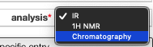
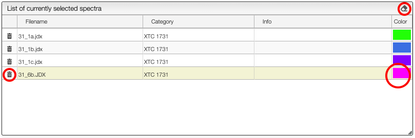
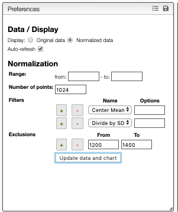

# Create analytical report from spectra

Thie program allows to define and apply analatical procedure on one or more spectra. The general principle is:

- select spectra
- define zones that will be associated to a variable and for which the following parameters are calculated:
  - integration
  - point for min y value
  - point for max y value

This software allows either to create new analytical report of to use an existing one.

## Select and preprocess spectra

This application can be applied on different kind of spectra. You will first need to decide what kind of spectra you want to use by selecting the corresponding category:

Selection of spectra to analyse is achieved with one of those 3 methods:

At the level of the sample by either clicking on the `+`, this will add all the spectra related to this sample or on the `+` on the top of the sample box to add all the spectra of all the selected samples.

If you select a sample it is also possible to add a specific spectrum by clicking on the `+` at the level of the spectra list.

From the list of selected spectra it is still possible to:

- delete a specific spectrum by clicking on the trash next to the spectrum
- delete all the selected spectra by clicking on the eraser on the top of the window
- change individually the color of spectra

In order to display the spectra you need to click on `Update data and charts`. This will recalculate the spectra based on the specified preferences:

- `Keep original data` this is extremely memory intensive and should not be used with large number of spectra. It is however practical to setup new protocols on small dataset
- `Display original data or normalized data` displaying the normalized data allows to see exactly what will be used for further calculation. Displaying the original data is only useful during new method developement.
-

## Load existing analytical procedure

## Create zones

## Define a formula

## Create a report
