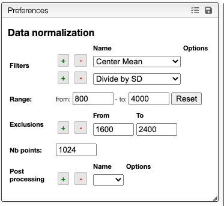

# Data normalization

In order to compare spectra:
- to select the representative part of the spectra that is expected to be important for the analysis
- to remove large peaks not characteristic of the sample (like water in NMR spectra) that could interfere with the analysis
- to reduce the number of points in order to accelerate the analysis
- to preprocess the data in order to reduce the impact of sample preparation or experimental artifacts

## Selecting the range

The data normalization process will select equidistant `Nb points` between the `From` and `To` values.

## Filters

You may also apply various `Filters` that allows to normalize or transform the data. Among those filters we have:
- Center mean
- Divide by SD (standard deviation)
- Rescale: set the min value to 0 and the max value to 1
- Normalize: set the sum of all the points to 1
- Align: create a peak picking between `from` / `to` and calculate the mean X value between the `nbPeaks` highest peaks. The spectrum will be moved so that the mean has the `targetX` value.

One classical preprocessing algorithm is [Standard Normal Variate (SNV)](http://wiki.eigenvector.com/index.php?title=Advanced_Preprocessing:_Sample_Normalization#SNV_.28Standard_Normal_Variate.29). This preprocessing can be achieved by selecting the 2 options `Center mean` and `Divide by SD`.

## Exclusions

Depending the analysis some region should be removed in order to improve the analysis. For example NMR spectroscopy in water yields to a large peak around 4.5ppm and using exclusion zone it can be removed from the analysis.

## Large dataset

The list of the spectra in the dataset is displayed in the following table: 

In some cases it is not possible to keep in memory the original spectra and the system will only keep the normalized spectra. Therefore it will not be possible to change the normalization parameters anymore.

## Preview

A preview of the normalized spectra as well as the exclusions zones will be displayed. This allows to fine tune the processing.

The superimposed spectra can be manipulated without numerous [advanced features described here](../visualization/README.md).
