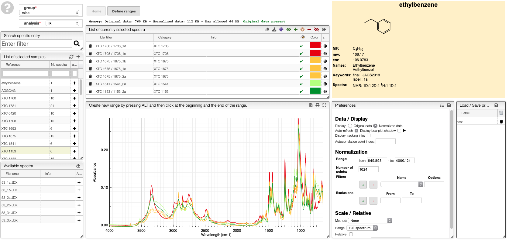

# Spectra selection

All the spectra analysis tools start with a phase of selection.

## Select samples

In order to facilitate the analysis of the spectra it is advised to have samples containing representative spectra in order to evaluate the intra-variability as well as the reproducibility.

Selection of spectra to analyse is achieved with one of those 3 methods:

At the level of the sample by either clicking on the `+`, this will add all the spectra related to this sample or on the `+` on the top of the sample box to add all the spectra of all the selected samples.

If you select a sample it is also possible to add a specific spectrum by clicking on the `+` at the level of the spectra list.

## Preprocess the spectrum

In order to create the PCA it is important:
- to select the representative part of the spectra that is expected to be important for the analysis (high variance between different samples, for infrared 800 to 1600 for example)
- to remove large peaks not characteristic of the sample (like water in NMR spectra) that could interfer with he analysis
- to reduce the number of points in order to accelerate the analysis.
- to preprocess the data in order to reduce the impact of sample preparation. One classical preprocessing algorithm is [Standard Normal Variate (SNV)](http://wiki.eigenvector.com/index.php?title=Advanced_Preprocessing:_Sample_Normalization#SNV_.28Standard_Normal_Variate.29). This preprocessing can be achieved by selecting the 2 options `center data`and `scale data`.

2 previous are available while filtering the data. The first preview, directly applied on the original spectra will display the area taken into account

The second preview will show exactly the points that will be submitted to the PCA algorithm. Those previews can be visualize in the `PCA` tab.

