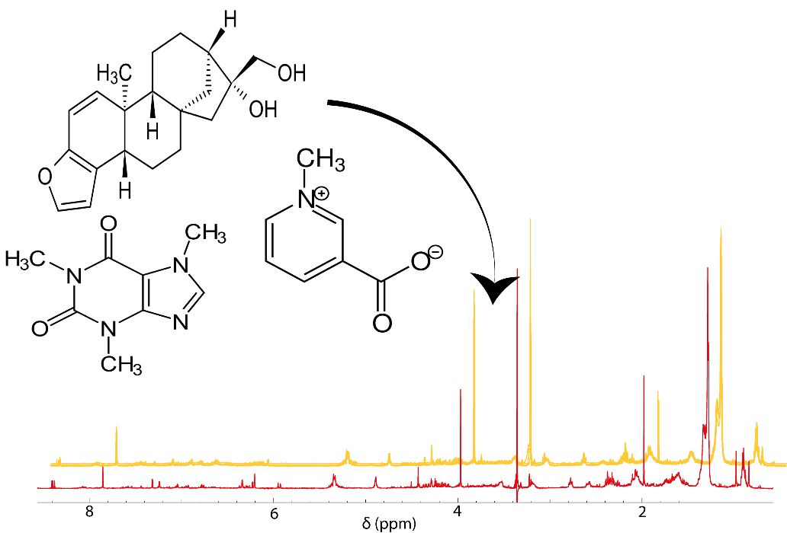

# NMR dataset generator

This tool is designed with the main purpose of building artificial 1H NMR data sets from your own molfiles. This could be very helpful in cases where it is necessary to simulate specific situations in metabolomics.

