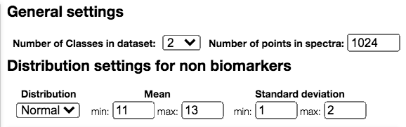

## Specify settings

In this part is allowed to choose the number of points of the spectra in the dataset, the number of classes to simulate and the range for the mean and the standard deviation of the concentration of metabolites in the dataset:

